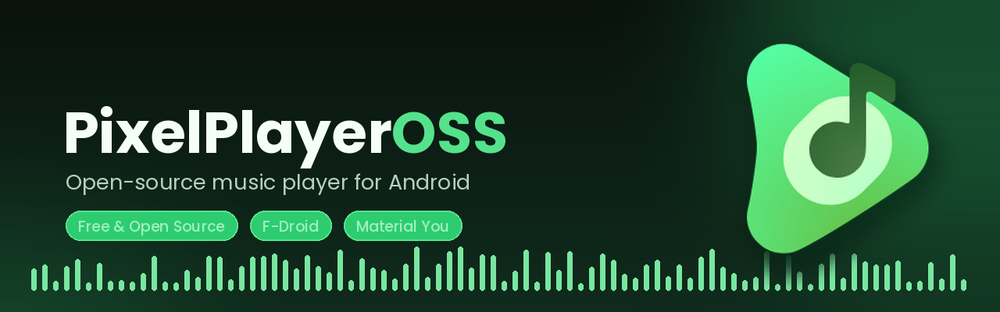

# PixelPlayerOSS

<p align="center">
  
</p>

<p align="center">
  <a href="https://github.com/KDharshana/PixelPlayerOSS/releases/latest">
    
  </a>
  <a href="https://f-droid.org/packages/com.lostf1sh.pixelplayeross/">
    
  </a>
  <a href="https://github.com/dharshan-X">
    
  </a>
  
  
  
</p>

<p align="center">
  
  
  
  
</p>

---

## Executive Overview

PixelPlayerOSS is an advanced Android audio player and streaming client engineered with Jetpack Compose and Material 3 Expressive principles. It unifies local high-resolution audio file playback, self-hosted media server streaming (Navidrome, Jellyfin), and client-side YouTube Music discovery into a singular, high-performance audio environment.

The project is designed with strict privacy and performance standards:
- Zero proprietary tracking libraries (no Firebase, Crashlytics, or Google Analytics).
- No Google Play Services runtime dependencies.
- Client-side streaming resolution executing directly on-device without intermediary proxy servers.
- Full offline capability by default, with modular, opt-in online extensions.

- **Package Identifier**: `com.lostf1sh.pixelplayeross`
- **Minimum SDK**: Android 11 (API Level 30)
- **Target SDK**: Android 15 (API Level 35) / Compile SDK 37
- **License**: GNU General Public License v3.0

---

## Architecture and Core Subsystems

### 1. DualPlayerEngine and Playback Pipeline
- **Engine Core**: Dual-instance playback engine built on AndroidX Media3 and ExoPlayer, routing playback through a dedicated background `MusicService`.
- **Transitions and Crossfade**: True gapless playback, customizable crossfade durations, and non-linear audio transition curves.
- **Resilience and Offload**: Dynamic audio offload stall detection and automated decoder recovery, intelligent pre-buffering, and transient audio focus management.
- **Audio Tuning**: Integrated ReplayGain track and album gain normalization, 10-band equalizer support, pitch/tempo adjustment, and sleep timer scheduling.

### 2. Client-Side YouTube Music Integration
- **Direct Innertube Engine**: Embedded pure-Kotlin extractor querying YouTube Music internal endpoints directly on-device without third-party scraping infrastructure.
- **Stream Proxy and Expiry Management**: In-memory proxy (`YouTubeStreamProxy`) with dynamic token expiration parsing (`&expire=`), upstream HTTP 401/403/404/410 error recovery, and seamless HTTP byte-range forwarding.
- **Discovery Surfaces**: Algorithmic Quick Picks, dynamic continuous radio mixes, new releases, mood and genre carousels, and multi-artist exploration.
- **High-Resolution Artwork**: Automated thumbnail pipeline upscaling artwork to 1024px Ultra-HD resolution.

### 3. Self-Hosted Cloud Streaming and Scrobbling
- **Navidrome and Subsonic API**: Compatibility with Subsonic-compliant endpoints for remote library synchronization, artist/album navigation, server-side search, and on-demand streaming.
- **Jellyfin Integration**: Native REST API client supporting token authentication, collection browsing, and direct media streaming.
- **ListenBrainz Scrobbling**: Real-time playback scrobbling, now-playing presence updates, and offline scrobble persistence with background WorkManager synchronization.

### 4. Unified Library and Hybrid Playlists
- **Full-Text Search (FTS4)**: Room SQLite database with virtual FTS4 tables indexing local files, cloud items, and YouTube Music tracks concurrently.
- **Source Filtering**: Single-tap switching between Unified, Local Only, and YouTube Music library modes.
- **Hybrid Playlists**: Full support for mixed playlists containing any combination of local audio files, Navidrome tracks, Jellyfin streams, and YouTube Music items.
- **Multi-Artist Parsing**: Relational indexing for collaborative artist tracks with individual artist navigation and metadata normalization.

### 5. Bundled Offline Download Manager
- **Complete Download Pipeline**: Background WorkManager download coordinator capturing remote audio streams, companion high-resolution cover art (`.jpg`), and companion synchronized lyrics (`.lrc`).
- **TagLib Native Tagging**: Directly embeds Title, Artist, Album, Cover Artwork picture bytes, and Synchronized LRC text into downloaded audio files using TagLib.
- **Zero-Network Interception**: ExoPlayer automatically detects downloaded local copies when playing tracks from any screen, routing directly to local storage without network requests.
- **Dedicated Offline Hub**: Downloads screen with storage management and instant one-tap playback on completed items.

### 6. Lyrics Subsystem
- **Multi-Source Engine**: Priority fallback across embedded TagLib tags, local `.lrc` companion files, YouTube Music synchronized transcript feeds, and LRCLIB cloud queries.
- **Interactive Lyrics UI**: Synchronized line-by-line scrolling, word-level highlight animations, romanization engines (Japanese, Korean, Devanagari, Gurmukhi, Cyrillic), and embedded lyrics editing.

### 7. Modern UI and Material 3 Expressive Design
- **Dynamic Theming**: Color extraction using Material You dynamic palettes from active track artwork.
- **App Widgets**: Glance-based responsive home screen widgets with playback controls and real-time state synchronization.
- **Expressive Navigation**: Fluid transitions, bottom sheet player presentation, and ergonomic one-handed layout design.

---

## Modular Online Services Reference

| Service | Protocol / Source | Purpose | Authentication | Default State |
| :--- | :--- | :--- | :--- | :--- |
| **YouTube Music** | Innertube Client (Kotlin) | Online search, streaming, radio queues, artist discovery, and 1024px art | None required | Enabled |
| **Navidrome / Subsonic** | Subsonic REST API | Library synchronization, remote streaming, and offline downloads | Server credentials | Disabled (Opt-in) |
| **Jellyfin** | Jellyfin REST API | Server media streaming, library browsing, and offline downloads | Server credentials | Disabled (Opt-in) |
| **ListenBrainz** | ListenBrainz API | Real-time playback scrobbling and listening history tracking | User API token | Disabled (Opt-in) |
| **LRCLIB** | LRCLIB REST API | Synchronized and plain text lyrics retrieval fallback | None | Disabled (Opt-in) |
| **MusicBrainz** | MusicBrainz XML/JSON | On-demand metadata enrichment and artist identifier verification | None | On-demand |
| **Deezer** | Deezer Public API | Artist picture retrieval for local audio files | None | Disabled (Opt-in) |

---

## Supported Codecs and Containers

| Format / Codec | Extension | Local Playback | Cloud Streaming | Offline Download | Metadata Tagging |
| :--- | :--- | :--- | :--- | :--- | :--- |
| **FLAC** | `.flac` | Supported (Hi-Res) | Supported | Supported | Supported (TagLib) |
| **Opus** | `.opus`, `.ogg` | Supported | Supported (YouTube/WebM) | Supported | Supported (TagLib) |
| **AAC / M4A** | `.m4a`, `.aac` | Supported | Supported | Supported | Supported (TagLib) |
| **MP3** | `.mp3` | Supported | Supported | Supported | Supported (TagLib) |
| **Ogg Vorbis** | `.ogg` | Supported | Supported | Supported | Supported (TagLib) |
| **WAV** | `.wav` | Supported (PCM) | Supported | Supported | Supported (TagLib) |
| **WebM Audio** | `.webm` | Supported | Supported (YouTube) | Supported | Supported (TagLib) |

---

## Technical Stack

| Layer | Technologies and Libraries |
| :--- | :--- |
| **Language and Runtime** | Kotlin 2.4, Kotlin Coroutines, StateFlow, Java 21 |
| **UI Framework** | Jetpack Compose, Compose Foundation, Material 3 Expressive, Navigation Compose |
| **Audio and Media Engine** | AndroidX Media3 (ExoPlayer, Session, UI, Decoder), Custom DualPlayerEngine |
| **Database and Persistence** | Room SQLite 2.7+ with FTS4 Virtual Tables, Jetpack DataStore Preferences |
| **Dependency Injection** | Dagger Hilt 2.55+ |
| **Background Processing** | AndroidX WorkManager with Hilt Assisted Injection |
| **Networking and Serialization** | OkHttp 4, Retrofit 2, Kotlinx Serialization, Gson |
| **Native Tagging** | TagLib (C++ bindings via JNI) |
| **Image Pipeline** | Coil 3 |
| **Home Widgets** | AndroidX Glance |
| **Logging and Diagnostics** | Timber, Custom Audio Diagnostic Pipeline |

---

## Project Layout

```
PixelPlayerOSS/
├── app/
│   ├── schemas/                          # Versioned Room DB JSON schemas
│   └── src/
│       ├── androidTest/                  # Instrumentation and database migration tests
│       ├── main/
│       │   ├── java/com/lostf1sh/pixelplayeross/
│       │   │   ├── data/
│       │   │   │   ├── backup/           # JSON backup and restore modules
│       │   │   │   ├── database/         # Room Database, DAOs, Entities, Migrations
│       │   │   │   ├── jellyfin/         # Jellyfin API client and repository
│       │   │   │   ├── media/            # Audio metadata reader, editor, ReplayGain
│       │   │   │   ├── model/            # Core domain models (Song, Album, Artist, Lyrics)
│       │   │   │   ├── navidrome/        # Subsonic API client and repository
│       │   │   │   ├── network/          # HTTP clients, Innertube parser, LRCLIB, ListenBrainz
│       │   │   │   ├── offline/          # CloudOfflineRepository and download coordinator
│       │   │   │   ├── preferences/      # DataStore preference repositories
│       │   │   │   ├── repository/       # Music, Search, Lyrics, and Artist repositories
│       │   │   │   ├── service/          # Media3 MusicService, DualPlayerEngine, audio processors
│       │   │   │   ├── stream/           # Local authenticated proxy and security validators
│       │   │   │   ├── worker/           # Background download and sync WorkManager workers
│       │   │   │   └── youtube/          # YouTube repository, stream proxy, and radio feeds
│       │   │   ├── di/                   # Dagger Hilt modules
│       │   │   ├── presentation/         # Compose UI screens, dialogs, navigation, ViewModels
│       │   │   ├── ui/                   # Theme, dynamic colors, typography, Glance widgets
│       │   │   └── utils/                # Audio format utilities, lyrics formatters, security checks
│       │   └── res/                      # Android resources, vector drawables, layouts, localized strings
│       └── test/                         # Unit tests (parsers, viewmodels, engines)
├── baselineprofile/                      # Macrobenchmark baseline profile generators
├── docs/                                 # Architectural Decision Records (ADRs) and release documentation
├── gradle/                               # Gradle wrapper and build configuration scripts
└── fastlane/                             # Fastlane metadata and automated distribution configuration
```

---

## Building and Development

### Environment Requirements
- **JDK**: Java Development Kit 21
- **Android SDK**: Build tools 35.0.0+, Platform SDK 37 (API 30+ minimum)
- **Gradle**: 9.x+ (managed via `./gradlew`)

### Build Commands

Clone the repository:
```sh
git clone https://github.com/KDharshana/PixelPlayerOSS.git
cd PixelPlayerOSS
```

Assemble Debug APK:
```sh
./gradlew :app:assembleDebug
```

Assemble Universal Debug APK (single binary without ABI splits):
```sh
./gradlew :app:assembleDebug -Ppixelplayer.enableAbiSplits=false
```

Assemble Signed Release APKs:
```sh
./gradlew :app:assembleRelease
```

Execute Unit Test Suite:
```sh
./gradlew :app:testDebugUnitTest
```

Run Android Lint Analysis:
```sh
./gradlew :app:lintDebug
```

Generate Baseline Profiles (requires connected device or emulator):
```sh
./gradlew :baselineprofile:generateBaselineProfile
```

---

## Distribution and Downloads

### Release Channels
- **F-Droid**: Available in the official F-Droid catalog:
  - Package: `com.lostf1sh.pixelplayeross`
- **GitHub Releases**: Download pre-compiled signed APK binaries from the [Releases Page](https://github.com/KDharshana/PixelPlayerOSS/releases).
- **Obtainium**: Configure Obtainium with the repository URL: `https://github.com/KDharshana/PixelPlayerOSS`.

### Architecture Packages
- **`arm64-v8a`**: Optimized for modern 64-bit ARM Android devices.
- **`armeabi-v7a`**: Compatible with legacy 32-bit ARM devices.
- **Universal**: Contains all native binaries in a single package.

---

## Contributing and Guidelines

Contributions are welcome. Please ensure that:
1. Code follows the architectural conventions documented in `AGENTS.md` and `docs/`.
2. All playback modifications route through `MusicService` / `MediaController` rather than direct player manipulation.
3. Database schema modifications include an incremental migration in `data/database/Migrations.kt` and an exported schema JSON in `app/schemas/`.
4. All unit tests pass cleanly before submitting PRs: `./gradlew testDebugUnitTest`.

Refer to [CONTRIBUTING.md](CONTRIBUTING.md) for pull request guidelines and [SECURITY.md](SECURITY.md) for security reporting protocols.

---

## License and Attribution

PixelPlayerOSS is licensed under the terms of the **GNU General Public License v3.0** (`SPDX-License-Identifier: GPL-3.0-or-later`).

```text
PixelPlayerOSS
Copyright (C) 2026 Theo Vilardo and Contributors

This program is free software: you can redistribute it and/or modify
it under the terms of the GNU General Public License as published by
the Free Software Foundation, either version 3 of the License, or
(at your option) any later version.

This program is distributed in the hope that it will be useful,
but WITHOUT ANY WARRANTY; without even the implied warranty of
MERCHANTABILITY or FITNESS FOR A PARTICULAR PURPOSE.  See the
GNU General Public License for more details.

You should have received a copy of the GNU General Public License
along with this program.  If not, see <https://www.gnu.org/licenses/>.
```

Third-party dependencies and licensing notices are detailed in [THIRD_PARTY_NOTICES.md](THIRD_PARTY_NOTICES.md).

<p align="center">
  Maintained by <a href="https://github.com/dharshan-X">quietrays</a>
</p>

